# BoardGamers
BoardGamers is a site that has been created solely with the purpose of sharing the passion of playing boardgames. The site allows users to create posts with some of their favourite games, some of which may be very common around the world, and others which could interest users depending on their specific likes and/or requirements.

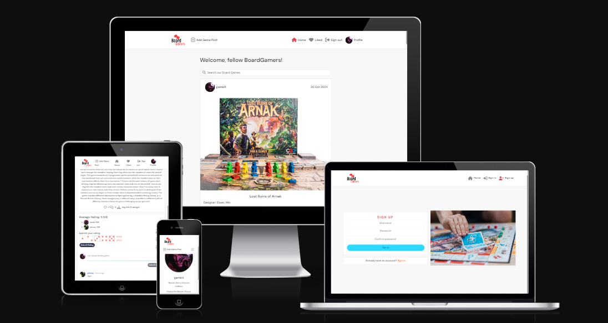

The live link for "BoardGamers" can be found [HERE](https://boardgamers-ci-364d7fb71032.herokuapp.com/)

You can also view the backend API along with its README.md [HERE](https://github.com/JonathanDussot/drf-api-bg)

## Table of Contents
+ [UX](#ux "UX")
  + [Site Purpose](#site-purpose "Site Purpose")
  + [Site Goal](#site-goal "Site Goal")
  + [Audience](#audience "Audience")
  + [Communication](#communication "Communication")
  + [Existing User Goals](#existing-user-goals "Existing User Goals")
  + [New User Goals](#new-user-goals "New User Goals")
+ [User Stories](#user-stories "User Stories")
  + [Admin stories](#admin-stories "Admin stories")
  + [Site User stories](#site-user-stories "Site User stories")
+ [Design](#design "Design")
  + [Colour Scheme](#colour-scheme "Colour Scheme")
  + [Typography](#typography "Typography")
  + [Imagery](#imagery "Imagery")
+ [Features](#features "Features")
  + [Existing Features](#existing-features "Existing Features")
  + [C.R.U.D](#crud "C.R.U.D")
+ [Testing](#testing "Testing")
  + [Validator Testing](#validator-testing "Validator Testing")
  + [Unfixed Bugs](#unfixed-bugs "Unfixed Bugs")
+ [Technologies Used](#technologies-used "Technologies Used")
  + [Main Languages Used](#main-languages-used "Main Languages Used")
  + [Frameworks, Libraries & Programs Used](#frameworks-libraries-programs-used "Frameworks, Libraries & Programs Used")
+ [Deployment](#deployment "Deployment")
+ [Credits](#credits "Credits")
  + [Content](#content "Content")
  + [Media](#media "Media")

## UX

### Site Purpose:
The aim of this site is to bring all *board gamers* together from around the world.  It is still a rather niche market, yet it has been gaining plenty of terrain in recent years with its appealing designs and fun, dynamic experiences capable of uniting an entire family round the table on a friday night in this era of digital dominance.  The *BoardGamers* site alienates no-one as its diverse categories of gaming are endless and bound to attract users regardless of devotion, age or table space.  User can also leave reviews on games others have posted, along with their personal ratings.  They can also like game posts and have instant access to them through the 'Liked' tab.

### Site Goal:
To propagate an extremely healthy and enjoyable hobby with the family as entire communities are now constantly turning to board gaming in order to teach our young generation that there is much more fun to be had in company than in a virtual void, not to mention the many people who have developed a passion throughout their lives and just want to share this with their friends and community. This site will encourage just that.

### Audience:
Naturally it could be assumed that only the 'gaming nerds' may want to reach and enter the gates of our website, but seeing how user-friendly and interactive we have designed our site, it is a warm, welcoming environment for those who wish to take up the hobby or simply indulge themselves with the details.

### Communication:
users are provided with the possibility to view eachother's profiles and, in the future, interact with one another.

### Existing User Goals:
The joy of never feeling old, as we are continuously given new, innovative models of gaming to share and recommend within the community of *BoardGamers*.

### New User Goals:
To feel welcomed by a never-dying culture with a vast variety of gaming genres and complexities to serve as endless means to suit their many needs.

### Future Goals:
- Currently there is a file (CurrentUserContext.js) which will in the future provide a scoreboard of sorts with the top games based on users' average ratings ranked from highest to lowest.
- Users may also benefit from an online forum to discuss trending topics more interactively among the community members.
- An option to inform the community on events held around the world to promote new products and get the *BoardGamers* community more involved in what's to come. 

## User Stories
Not all stories have been implemented. Some have been left for future implementations as the site grows and expands.

### Admin stories:
#### As an admin:
These can be found in our [API's README.md](https://github.com/JonathanDussot/drf-api-bg/blob/main/README.md#user-stories)

### Site User stories:
- Here is a list of all my user stories which can be found in my frontend [project](https://github.com/users/JonathanDussot/projects/7/views/1) which employs the Agile methodology approach in an organized manner, each with their labels as per MoSCoW prioritization of tasks. 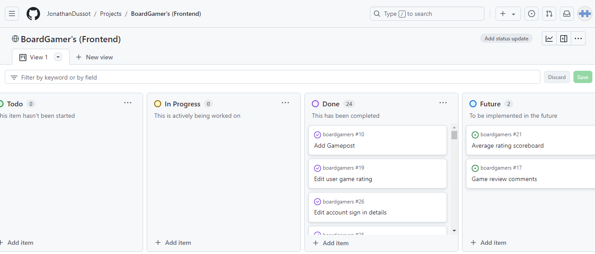

#### Home:
- [x] As a user I can enter key words or a user name in the search field so that I can filter my viewed games list to only entries of that particular keyword.
- [x] As a user I can stay logged in until I choose to logout so that my user experience is not compromised.
- [x] As a user I can scroll down so that I can load more list items to view instead of switching pages.
- [x] As a user I can view all games on the home page.
- [x] As a signed in user I can sign out so that I can close my account and return to home page.

#### Authentication:
- [x] As a user I can determine I'm logged in or if a log in is necessary.
- [x] As a user I can sign in so that I can use all user features from my account.
- [x] As a new user I can sign up so that I can create an account as a user.

#### Games posts:
- [x] As a logged in user I can delete a post I own so that it is removed altogether.
- [x] As a logged in user I can edit a game post I own so that I can update the post details.
- [x] As a logged in user I can Create a new Game post so that I can add a game to the hme page for other users to see.

#### Game Reviews:
- [x] As a logged in user I can delete a review I own so that it is removed altogether.
- [x] As a logged in user I can edit a review I own so that I can update the information within my review.
- [x] As a logged in user I can create a review so that other users and I can interact.
- [x] As a user I can click on a game and view its reviews.

#### Likes:
- [x] As a logged in user I can view a list from my NavBar of all the Games I have liked.
- [x] As a logged in user I can like and unlike a game so that express my interest in others' posts.

#### Ratings:
- [x] As a logged in user I can delete a game rating I own so that it is removed from game post's existing ratings.
- [x] As a logged in user I can edit my game rating so that I can update my rating for others to see.
- [x] As a logged in user I can give a game a rating so that I can interact with other users' game posts.

#### Navigation bar:
- [x] As a user I can always view the NavBar so that I can navigate between pages.

#### Profiles:
- [x] As a logged in user I can change my username or password for access purposes.
- [x] As a logged in user I can view and edit my own profile image and details so that other users can see when visiting my profile.
- [x] As a user I can view other users' profiles so that I can see their profile information.

## Design

### Wireframes:

#### Home Page: 

P
E
N
D
I
N
G
!
!
!

### Colour Scheme:


P
E
N
D
I
N
G
!
!
!

### Typography:
All fonts were obtained from the Google Fonts library. I chose the following fonts for the page:
P
E
N
D
I
N
G
!
!
!

### Imagery:

#### Logo

- This logo was created by me using [Free Logo Design](https://app.freelogodesign.org/signin).


#### Favicon

- This favicon was selected from [iconos8](https://iconos8.es/).


#### Sign up/ Sign in image

This image was taken from [Pexels](https://www.pexels.com/@anete-lusina/) for my Sign In and Sign Up pages.


#### Dice (Rating)

All the images of dice in this image were taken from [freeiconspng](https://www.freeiconspng.com/images/dice-png) for my dice rating system.

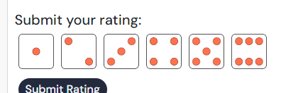

## Features

### Existing Features:

#### Home Page:

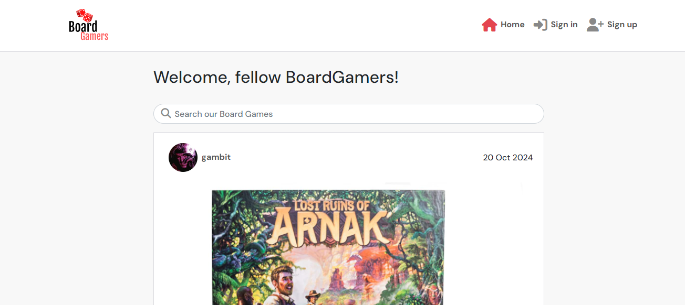

#### Navigation Bar:

##### Desktop:

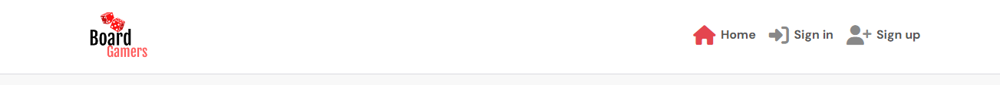

##### Mobile:

-Upon clicking on the dropdown menu, options appear:

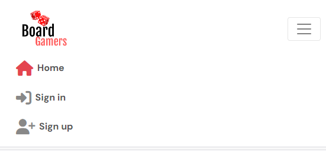

#### Games Page:

- Games appear in a list in order from latest to oldest.

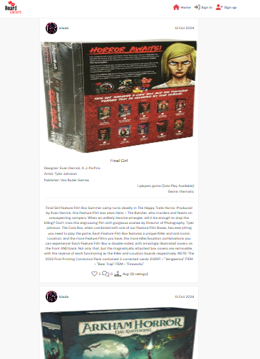

#### Count features on Games Page:

-Displays total amount of likes, reviews, and average of ratings respectively.

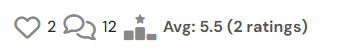

#### Game Page:

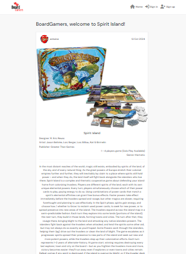

#### Review feature:

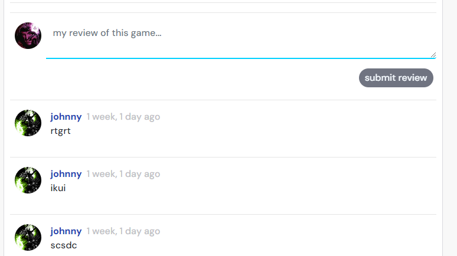

#### Like icon feature:

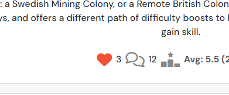

#### Ratings feature:

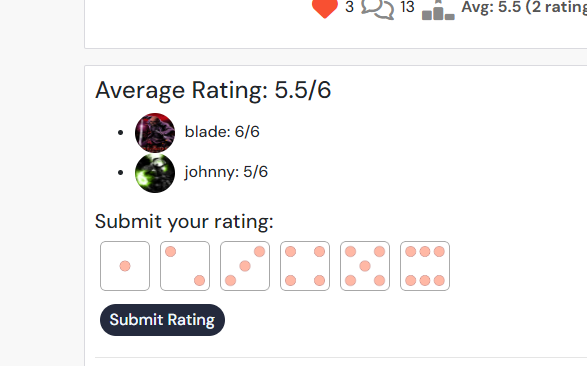

#### Create Game Page:

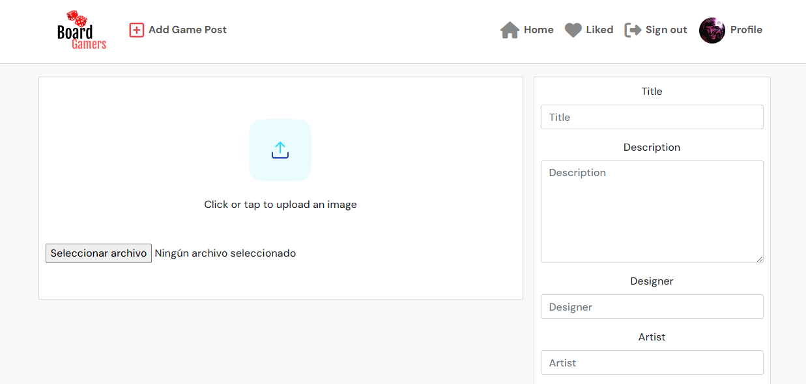

#### Search bar feature:

- Waits a couple of seconds before updating search incase user is still typing.

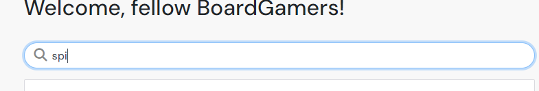

#### Liked page:

- Displays a list of all liked game in order from latest to oldest.

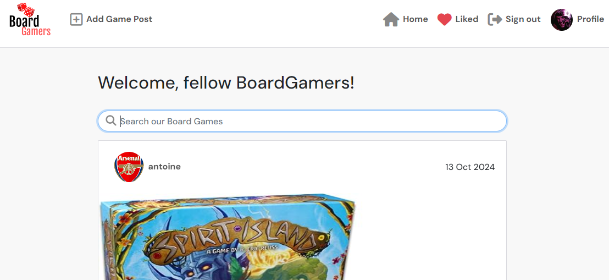

#### Profile page:

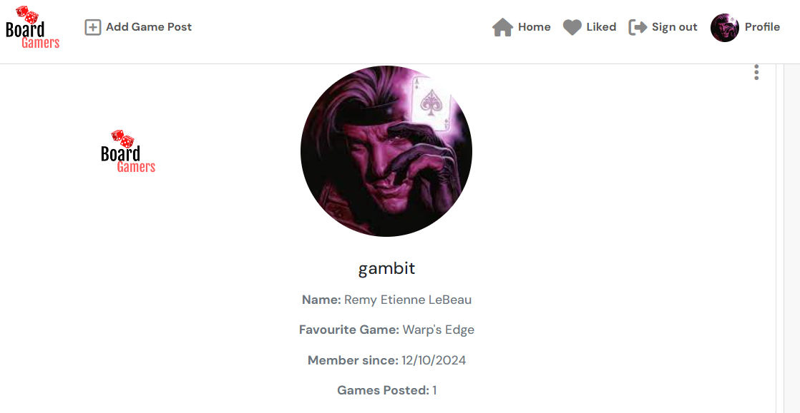

#### Sign in & Sign up:

##### Sign-in:

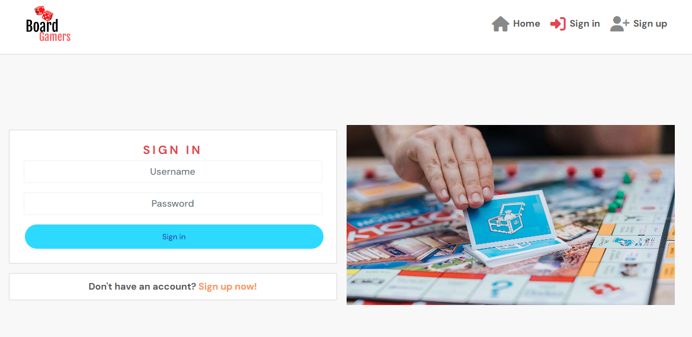

##### Sign-up:

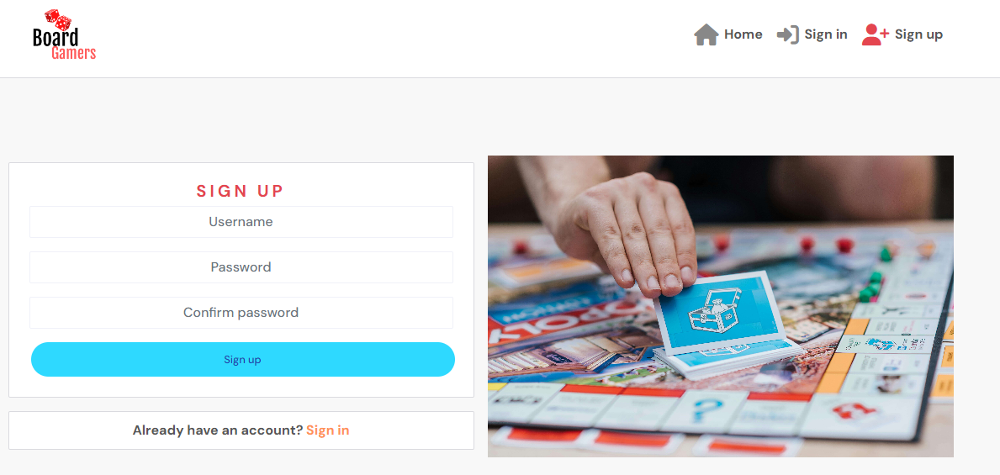

### C.R.U.D:

#### Created Game Page:
- Once the dots to the top-right corner are clicked on, they are given the option to edit or delete the game post they've created.
- Only the owner of the Game is shown the three-dot dropdown menu with access to these options.

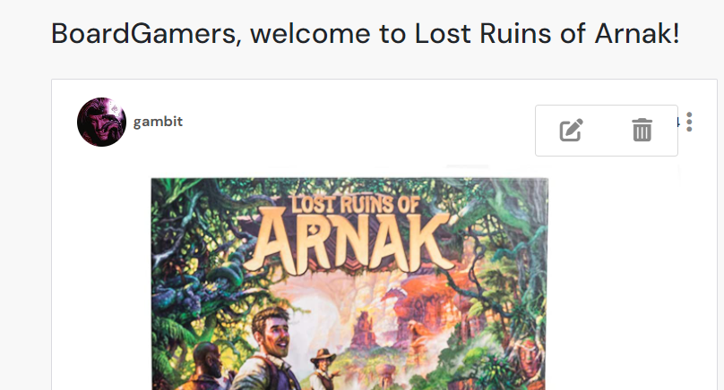

#### Review Game Page:
- Once the dots to the top of the review are clicked on, they are given the option to edit or delete the review they've created.
- Only the owner of the review is shown the three-dot dropdown menu with access to these options.

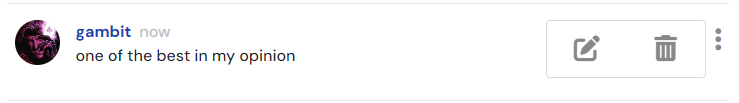

#### Like Icon:
- The user is given the option to unlike the Game post the same way they liked it to begin with, by clicking on the icon. icon will change colour.
- Users are not given the possibility to like their own posts.


#### Ratings Game Page:
- User is given the option below their initial rating to edit and update their rating or delete it.
- Only the owner of the rating is shown these options.
- If the user chooses to update, and clicked on the 'edit' button, the six dice images will re-appear for the user to correctly update.

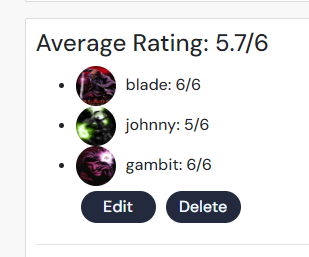

#### Profile Page:
- Once the dots to the top-right corner are clicked on, they are given the option to edit their profile or change either their username or password.
- Only the owner of the Game is shown the three-dot dropdown menu with access to these options.

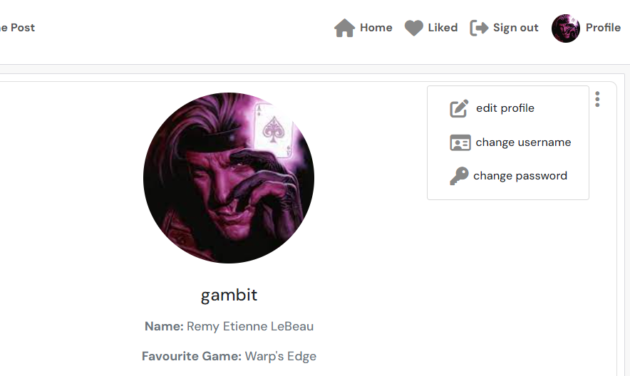

### Features Left to Implement
- Using the GameDataContext.js, we plan to add a feature to the game to display the top-rated games according to the total averages our community users have given.
- Forum for users to have more in-depth conversations and thus increase user interaction within the community.
- Nested comments within the review section to users to interact or react to each other's reviews.
- Additional app dedicated to informing our users of upcoming board-gaming events.

## Testing

### Validator Testing
| **TEST** | **ACTION** | **EXPECTATION** | **RESULT** |
| ----------------------------- | ----------------------- | --------------------------- | ---------- |
| gems - settings.py | PEP8 validator | [No issues found](static/images-readme/pep8-validator-python.png) | ✅ |
| gems - urls.py | PEP8 validator | No issues found | ✅ |
| blog app - forms.py | PEP8 validator | No issues found | ✅ |
| blog app - models.py | PEP8 validator | No issues found | ✅ |
| blog app - views.py | PEP8 validator | No issues found | ✅ |
| blog app - urls.py | PEP8 validator | No issues found | ✅ |
| blog app - admin.py | PEP8 validator | No issues found | ✅ |
| about app - forms.py | PEP8 validator | No issues found | ✅ |
| about app - models.py | PEP8 validator | No issues found | ✅ |
| about app - views.py | PEP8 validator | No issues found | ✅ |
| about app - urls.py | PEP8 validator | No issues found | ✅ |
| about app - admin.py | PEP8 validator | No issues found | ✅ |
| newsletter app - forms.py | PEP8 validator | No issues found | ✅ |
| newsletter app - models.py | PEP8 validator | No issues found | ✅ |
| newsletter app - views.py | PEP8 validator | No issues found | ✅ |
| newsletter app - urls.py | PEP8 validator | No issues found | ✅ |
| newsletter app - admin.py | PEP8 validator | No issues found | ✅ |
| resources app - forms.py | PEP8 validator | No issues found | ✅ |
| resources app - models.py | PEP8 validator | No issues found | ✅ |
| resources app - views.py | PEP8 validator | No issues found | ✅ |
| resources app - urls.py | PEP8 validator | No issues found | ✅ |
| resources app - admin.py | PEP8 validator | No issues found | ✅ |
| style.css | [W3C - Jigsaw](https://jigsaw.w3.org/css-validator/) validator | [No issues found](static/images-readme/w3c-validator-css.png) | ✅ |
| Home page - html | [W3C](https://validator.w3.org/) validator - source code | [No issues found](static/images-readme/w3c-validator-html.png) | ✅ |
| About page - html | W3C validator - source code | No issues found | ✅ |
| Post Details page - html | W3C validator - source code | No issues found | ✅ |
| Resources page - html | W3C validator - source code | No issues found | ✅ |
| Newsletter page - html | W3C validator - source code | No issues found | ✅ |
| Sign-in page - html | W3C validator - source code | No issues found | ✅ |
| Home page - html | lighthouse | [Acceptable scores](static/images-readme/lighthouse.png) | ✅ |
| About page - html | lighthouse | Acceptable scores | ✅ |
| Post-Details page - html | lighthouse | Acceptable scores | ✅ |
| Resources page - html | lighthouse | Acceptable scores | ✅ |
| Newsletter page - html | lighthouse | Acceptable scores | ✅ |
| Sign-in page - html | lighthouse | Acceptable scores | ✅ |
| WAVE results | WAVE | [Acceptable scores](static/images-readme/wave.png) | ✅ |
| Microsoft Edge browser | Launch site | Site opens without issue | ✅ |
| Google Chrome browser | Launch site | Site opens without issue | ✅ |

### Responsiveness testing

| **TEST**                      | **ACTION**              | **EXPECTATION**             | **RESULT** |
| ----------------------------- | ----------------------- | --------------------------- | ---------- |
| Home page - responsiveness    | Size site down to 320px | all elements stay on screen | ✅         |
| Home page - responsiveness    | Size site up to 1920px  | all elements stay on screen | ✅         |
| About page - responsiveness   | Size site down to 320px | all elements stay on screen | ✅         |
| About page - responsiveness   | Size site up to 1920px  | all elements stay on screen | ✅         |
| Post-Details page - responsiveness  | Size site down to 320px | all elements stay on screen | ✅         |
| Post-Details page - responsiveness  | Size site up to 1920px  | all elements stay on screen | ✅         |
| Resources page - responsiveness    | Size site down to 320px | all elements stay on screen | ✅         |
| Resources page - responsiveness    | Size site up to 1920px  | all elements stay on screen | ✅         |
| Newsletter page - responsiveness   | Size site up to 1920px  | all elements stay on screen | ✅         |
| Newsletter page - responsiveness   | Size site up to 1920px  | all elements stay on screen | ✅         |
| Sign-in page - responsiveness | Size site down to 320px | all elements stay on screen | ✅         |
| Sign-in page - responsiveness | Size site up to 1920px  | all elements stay on screen | ✅         |

### C.R.U.D. testing

| **TEST**          | **ACTION**             | **EXPECTATION**          | **RESULT** |
| ----------------- | ---------------------- | ------------------------ | ---------- |
| Newsletter subscription - Create     | Add new instance to DB | Instance created         | ✅         |
| Newsletter subscription - Read       | Retrieve all instances | Instances visible in UI  | ✅         |
| Newsletter subscription - Update     | Modify an instance     | Mods saved & visible     | ✅         |
| Newsletter subscription - Delete     | Delete an instance     | Instance removed from UI | ✅         |
| Comments - Create | Add new instance to DB | Instance created         | ✅         |
| Comments - Read   | Retrieve all instances | Instances visible in UI  | ✅         |
| Comments - Update | Add new instance to DB | Mods saved & visible     | ✅         |
| Comments - Delete   | Retrieve all instances | Instance removed from UI | ✅         |
| Like - Create | Add new instance to DB | Instance created         | ✅         |
| Like - Delete | Delete an instance     | Instance removed from UI | ✅         |

### FEATURES

| **TEST**                      | **ACTION**             | **EXPECTATION**                                           | **RESULT** |
| ----------------------------- | ---------------------- | --------------------------------------------------------- | ---------- |
| Navigation bar                | Click on nav link      | user routed to correct page                               | ✅         |
| Footer links                  | Click on footer links  | user routed to new browser tab                            | ✅         |
| Like button                   | Click "like"           | Post liked/unliked accordingly                            | ✅         |
| Comment section                   | Written empty message           | does not submit, prompts to write a message                            | ✅         |
| Comment section                   | Write message and submit           | user informed on pending approval                            | ✅         |
| Edit button                   | Click edit button      | user allowed to edit comment only if previously approved                             | ✅         |
| Delete button                 | Click delete button    | user allowed to delete comment only if previously approved                                | ✅         |
| Collaboration form                | Submit form    | user alerted on successful form                                | ✅         |
| External links in Resources                | Click link             | User routed to appropriate webpage                           | ✅         |
| Subscription                | enter invalid email             | User prompted to write a valid email                           | ✅         |
| Subscription CRUD buttons                | Click buttons            | User routed to appropriate page and UI updated                    | ✅         |
| Login                         | User logs in           | UI updates & user is logged in                            | ✅         |
| Sign up                       | User signs up          | new account created for the user                          | ✅         |
| Logout                        | User clicks logout     | UI updates, user is logged out, user cannot create a post | ✅         |

### BUG TESTING:
1. Heroku logs--tail error when deploying to Heroku:
 - Added correctly-written web: gunicorn gems.wsgi to ProcFile to link it correctly.

2. 'unexpected chunk number 1 (expected 0)' error:
 - This was caused be corrupted Data upon using loaddata with json.file according to Tutor Support.
 - Uncommented sqlite database and commented out external database to temporarily work on project before eventually providing a solution (mentioned in bug #3)

3. Opening new external Database:
 - Did pip install and pip freeze with all requirements, created env.py file, added new DB URL and secret key, collectstatic, updated CSRF, did makemigrations and migrate command and yet page would not load correctly.
 - The cloudinary URL was missing within the env.py, this allowed the page to load correctly.

4. CSS styles would not load:
 - Upon using terminal command to copy staticfiles into a template folder, accidently created and nested everything within an additional templates folder so url path did not connect.
 - Moved everything out to the correct template folder and css styles were loading correctly.

5. Admin interface content lacked RichText Editor for content fields in resources app:
 - summernote_fields was not correctly linked to content containers within the admin.py file.

6. Likes generated an error:
 - within the blog's models.py the model's related name for the like button clashed with the comment section, I changed the name so code could correctly distinguish model and this fixed the bug.

7. Validator error message <o:p>:
 - This was due to my population of the content fields having used my microsoft word to draft the tet before adding them to the admin interface, could not be seen in my code.
 - Manually accessed and edited code from Admin interface and deleted the tags.

8. Page would break when screen size was below 768px and only provide images:
 - Deleted 'flex: no-wrap' to fix this issue and correctly display text with the images so users can access post details for each post.

9. Editing a comment while awaiting approval:
 - Page would crash is user were to click on the edit button before comment had been approved.
 - Fixed the issue by removing the edit button for comments awaiting approval.

10. Navbar overflow:
 - Navbar displayed overflow off page between 1150px and 990px on all pages.
 - Reduced the logo size, nav-link size and text-muted size so elements would not cause navbar to overflow before collapsing as media response styles take effect.

11. Like button with a reverse path error:
 - Upon correcting some of the hyphens and underscores, the blog's urls.py path had the correct pattern, but the views.py file still had **'post-detail'** instead of **post_detail** within the reverse function call.

### Unfixed Bugs
1. Sign up form - HTML Validator errors:
- Upon validating, I noticed [4 errors with tags](static/images-readme/signup-html-errors.png) which were nowhere to be found within my code.
- With help from Tutor Support, we determined this was from Django's Allauth's error and that I could do nothing to fix it from my end.

## Technologies Used
### Main Languages Used
- HTML5
- CSS3
- Javascript
- Python
- Django
- SQL - Postgres

### Frameworks, Libraries & Programs Used
- [Google Fonts](https://fonts.google.com/) - for the font families: 
- [Font Awesome](fontawesome.com) - for the social network icons.
- [GitPod](https://www.gitpod.io/) - for creating html files, css stylesheet and python files.
- [GitHub](https://github.com/) - to store my repository for submission.
- Google Dev tools - to test and fix issues detected.
- [Pexels](https://www.pexels.com/) to use free images for site.
- [Free Pik](https://www.freepik.es/) to use free images for site.
- [Balsamiq](https://balsamiq.com/) - for the wireframe mockups of my webpage.
- [Am I Responsive?](https://ui.dev/amiresponsive) - to ensure the webpage displayed well on all devices.
- [Tiny PNG](https://tinypng.com/) to compress images.
- [DrawSQL](https://drawsql.app/) - for ERD mockups
- [FreeLogoDesign](https://app.freelogodesign.org/)
- [Colormind.io](http://colormind.io/) to generate color palette used. 
- [cdnjs](https://cdnjs.com/libraries/bootstrap) for bootstrap.
- Django
- Bootstrap

### Installed Packages:
- asgiref==3.8.1
- cloudinary==1.36.0
- crispy-bootstrap5==0.7
- dj-database-url==0.5.0
- dj3-cloudinary-storage==0.0.6
- Django==5.0.7
- django-allauth==0.57.2
- django-crispy-forms==2.2
- django-summernote==0.8.20.0
- gunicorn==20.1.0
- oauthlib==3.2.2
- psycopg2==2.9.9
- PyJWT==2.8.0
- python3-openid==3.2.0
- requests-oauthlib==2.0.0
- sqlparse==0.5.0
- urllib3==1.26.19
- whitenoise==5.3.0

## Deployment
The site was deployed to Heroku. The steps to deploy are as follows:
- Install Django & Gunicorn:
```pip3 install Django~=4.2.1```
- a django project was created using:
```django-admin startproject gems .```
- the blog app was then created with:
```python3 manage.py startapp blog```
- Install gunicorn to enable deployment to Heroku:
```pip3 install gunicorn~=20.1```
- Creating the requirements.txt file with the following command:
```pip3 freeze --local > requirements.txt```
- Install Django summernote:
```pip3 install django-summernote~=0.8.20.0```
- Install whitenoise for Heroku to serve its own static files:
```pip3 install whitenoise~=5.3.0```
- Add user authentication with the following:
```pip3 install django-allauth~=0.57.0```
- Install Cloudinary:
```pip3 install django-crispy-forms~=2.0 crispy-bootstrap5~=0.7```
- Install Cloudinary:
```pip3 install cloudinary~=1.36.0 dj3-cloudinary-storage~=0.0.6 urllib3~=1.26.15```
- Install Cloudinary:
```pip3 install dj3-cloudinary-storage```
- Install Cloudinary:
```pip3 install dj3-cloudinary-storage```
- which was then added to the settings.py file within our project directory.
- the changes were then migrated using:
```python3 manage.py makemigrations``` and ```python3 manage.py migrate```
- Collectstatic command for all static files to be deployed without issue:
```python3 manage.py collectstatic```
- navigated to [Heroku](www.heroku.com) & created a new app called hidden-gem-blog.
- added the Heroku Postgres database to the Resources tab.
- navigated to the Settings Tab, to add the following key/value pairs to the configvars:
1. key: SECRET_KEY | value: randomkey
2. key: PORT | value: 8000
3. key: CLOUDINARY_URL | value: API environment variable
4. key: DATABASE_URL | value: value supplied by Heroku
- added the DATABASE_URL, SECRET_KEY & CLOUDINARY_URL to the env.py file
- added the DATABASE_URL, SECRET_KEY & CLOUDINARY_URL to the settings.py file
- add an import os statement for the env.py file.
- added Heroku to the ALLOWED_HOSTS in settings.py
- created the Procfile
- pushed the project to Github
- connected my github account to Heroku through the Deploy tab
- connected my github project repository, and then clicked on the "Deploy" button
- The live link for "Hidden Gems" can be found [HERE](https://hidden-gem-blog-d08378ae9ea1.herokuapp.com/)

## Credits

### Content
- “I think therefore I blog” walkthrough: Assisted me hugelyfrom the start with initial steps such as commands, adding apps, designing models and the many installed apps and their purposes.  Permitted me to add on to them and expand what I already had.
- Slack community for the vast amount of support and information available to clear doubts and help with potential bugs.
- Tutor Support for their constant support with some of the questions or issues I had and the patience to make everything so clear and such a pleasant learning experience.
- CI for providing us with an exclusive Gitpod which helped tremendously considering the amount of hours dedicated to putting this project together, and hopefully many more for the future implementations and improvements to be made.
- **Location content**:
- [Royal Alaska Movers](https://www.royalalaskanmovers.com/north-pole-alaska-visitors-guide/) provided me with the content for Santa Claus's house within the blog posts.
- [Komoot](https://www.komoot.com/guide/1812719/attractions-in-fairbanks-north-star-borough) provided me with the content for the northern lights within the blog posts.
- [The Culture Trip](https://theculturetrip.com/south-america/peru/articles/how-to-visit-the-nazca-lines-in-peru) provided me with the content for the Nazca Lines within the blog posts.
- [Osprey Expeditions](https://ospreyexpeditions.com/interesting-facts-about-cano-cristales/) provided me with the content for Cano Cristales within the blog posts.
- [Forbes](https://www.forbes.com/sites/trevornace/2016/03/02/rainbow-mountains-china-earths-paint-palette/) provided me with the content for the Rainbow mountains in China within the blog posts.
- [Atlas Obscura](https://www.atlasobscura.com/places/santa-maria-dellisola-monastery) provided me with the content for the Monastery of Santa Maria Tropea within the blog posts.
- [Great Blue Hole](https://greatbluehole.net/) provided me with the content for the Great Blue Hole within the blog posts.
- [Jrailpass](https://www.jrailpass.com/blog/ashikaga-flower-park#:~:text=The%20Ashikaga%20Flower%20Park%20first,monument%20by%20the%20Tochigi%20Prefecture) provided me with the content for Ashikaga Flower Park within the blog posts.
- [Neuschwanstein Tickets](https://neuschwansteintickets.com/) provided me with the content for Neuschwanstein Castle within the blog posts.
- [Waitomo](https://www.waitomo.com/glowworms-and-caves/waitomo-glowworm-caves) provided me with the content for the Glow-worm Caves within the blog posts.
- [Indonesia Travel](https://www.indonesia.travel/gb/en/destinations/bali-nusa-tenggara/flores/lake-kelimutu.html) provided me with the content for the Kelimutu lakes within the blog posts.
- [Inside Kyoto](https://www.insidekyoto.com/arashiyama-bamboo-grove) provided me with the content for the Bamboo Groves within the blog posts.
- [https://ukraine.ua](https://ukraine.ua/cities-places/tunnel-of-love/) provided me with the content for the tunnel of love within the blog posts.
- [Go Visit Costa Rica](https://www.govisitcostarica.com/region/city.asp?cID=69) provided me with the content for Montaverde within the blog posts.
- [Adventure Clues](https://www.adventureclues.com/articles/36-unknown-places-in-the-world-that-will-take-your-breath-away/) provided me with alot of information about nearly all the locations chosen and gave me some great content to use within the excerpts
- [Adventurous Kate](https://www.adventurouskate.com/travel-resources/) for the extremely useful travelling tips used within my 'Travel Resources' section.

### Media
- [Freepik](https://www.freepik.es/search?format=search&last_filter=query&last_value=travel&query=travel) Here I got my [travel-suitcases.jpeg](static/images-readme/travel-suitcases.jpg) image.
- [Pexels](https://www.pexels.com/photo/people-sitting-on-boat-2108832/) I used the [pexels-riverboat.jpg](static/images-readme/pexels-riverboat.jpg) image from this sit provided by a photographer named Streetwindy.
- [Pexels](https://www.pexels.com/search/suitcase/) provided me with the [pexels-suitcase.jpg](static/images-readme/pexels-suitcase.jpg) image to use within the Resources section.
- [Flash Packer Connect](https://www.flashpackerconnect.com/blog/visiting-cano-cristales-a-journey-to-colombias-most-colorful-river) provided me with the [cano-cristales-post.jpeg](static/images-readme/cano-cristales-post.jpeg).