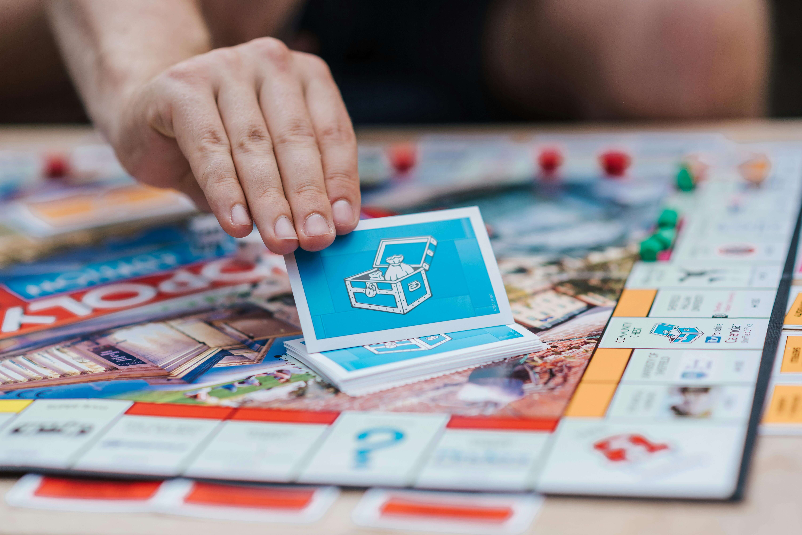

# BoardGamers
BoardGamers is a site that has been created solely with the purpose of sharing the passion of playing boardgames. The site allows users to create posts with some of their favourite games, some of which may be very common around the world, and others which could interest users depending on their specific likes and/or requirements.


The live link for "BoardGamers" can be found [HERE](https://boardgamers-ci-364d7fb71032.herokuapp.com/)

You can also view the backend API along with its README.md [HERE](https://github.com/JonathanDussot/drf-api-bg)

## Table of Contents
+ [UX](#ux "UX")
  + [Site Purpose](#site-purpose "Site Purpose")
  + [Site Goal](#site-goal "Site Goal")
  + [Audience](#audience "Audience")
  + [Communication](#communication "Communication")
  + [Existing User Goals](#existing-user-goals "Existing User Goals")
  + [New User Goals](#new-user-goals "New User Goals")
+ [User Stories](#user-stories "User Stories")
  + [Admin stories](#admin-stories "Admin stories")
  + [Site User stories](#site-user-stories "Site User stories")
+ [Design](#design "Design")
  + [Colour Scheme](#colour-scheme "Colour Scheme")
  + [Typography](#typography "Typography")
  + [Imagery](#imagery "Imagery")
+ [Features](#features "Features")
  + [Existing Features](#existing-features "Existing Features")
  + [C.R.U.D](#crud "C.R.U.D")
+ [Testing](#testing "Testing")
  + [Validator Testing](#validator-testing "Validator Testing")
  + [Unfixed Bugs](#unfixed-bugs "Unfixed Bugs")
+ [Technologies Used](#technologies-used "Technologies Used")
  + [Main Languages Used](#main-languages-used "Main Languages Used")
  + [Frameworks, Libraries & Programs Used](#frameworks-libraries-programs-used "Frameworks, Libraries & Programs Used")
+ [Deployment](#deployment "Deployment")
+ [Credits](#credits "Credits")
  + [Content](#content "Content")
  + [Media](#media "Media")

## UX

### Site Purpose:
The aim of this site is to bring all *board gamers* together from around the world.  It is still a rather niche market, yet it has been gaining plenty of terrain in recent years with its appealing designs and fun, dynamic experiences capable of uniting an entire family round the table on a friday night in this era of digital dominance.  The *BoardGamers* site alienates no-one as its diverse categories of gaming are endless and bound to attract users regardless of devotion, age or table space.  User can also leave reviews on games others have posted, along with their personal ratings.  They can also like game posts and have instant access to them through the 'Liked' tab.

### Site Goal:
To propagate an extremely healthy and enjoyable hobby with the family as entire communities are now constantly turning to board gaming in order to teach our young generation that there is much more fun to be had in company than in a virtual void, not to mention the many people who have developed a passion throughout their lives and just want to share this with their friends and community. This site will encourage just that.

### Audience:
Naturally it could be assumed that only the 'gaming nerds' may want to reach and enter the gates of our website, but seeing how user-friendly and interactive we have designed our site, it is a warm, welcoming environment for those who wish to take up the hobby or simply indulge themselves with the details.

### Communication:
users are provided with the possibility to view eachother's profiles and, in the future, interact with one another.

### Existing User Goals:
The joy of never feeling old, as we are continuously given new, innovative models of gaming to share and recommend within the community of *BoardGamers*.

### New User Goals:
To feel welcomed by a never-dying culture with a vast variety of gaming genres and complexities to serve as endless means to suit their many needs.

### Future Goals:
- Currently there is a file (CurrentUserContext.js) which will in the future provide a scoreboard of sorts with the top games based on users' average ratings ranked from highest to lowest.
- Users may also benefit from an online forum to discuss trending topics more interactively among the community members.
- An option to inform the community on events held around the world to promote new products and get the *BoardGamers* community more involved in what's to come. 

## User Stories
Not all stories have been implemented. Some have been left for future implementations as the site grows and expands.

### Admin stories:
#### As an admin:
These can be found in our [API's README.md](https://github.com/JonathanDussot/drf-api-bg/blob/main/README.md#user-stories)

### Site User stories:
- Here is a list of all my user stories which can be found in my frontend [project](https://github.com/users/JonathanDussot/projects/7/views/1) which employs the Agile methodology approach in an organized manner, each with their labels as per MoSCoW prioritization of tasks. 

#### Home:
- [x] As a user I can enter key words or a user name in the search field so that I can filter my viewed games list to only entries of that particular keyword. **(Sprint 2)**
- [x] As a user I can stay logged in until I choose to logout so that my user experience is not compromised. **(Sprint 2)**
- [x] As a user I can scroll down so that I can load more list items to view instead of switching pages. **(Sprint 2)**
- [x] As a user I can view all games on the home page. **(Sprint 1)**
- [x] As a signed in user I can sign out so that I can close my account and return to home page. **(Sprint 1)**

#### Authentication:
- [x] As a user I can determine I'm logged in or if a log in is necessary. **(Sprint 1)**
- [x] As a user I can sign in so that I can use all user features from my account. **(Sprint 1)**
- [x] As a new user I can sign up so that I can create an account as a user. **(Sprint 1)**

#### Games posts:
- [x] As a logged in user I can Create a new Game post so that I can add a game to the hme page for other users to see. **(Sprint 2)**
- [x] As a logged in user I can edit a game post I own so that I can update the post details. **(Sprint 2)**
- [x] As a logged in user I can delete a post I own so that it is removed altogether. **(Sprint 2)**

#### Game Reviews:
- [x] As a user I can click on a game and view its reviews. **(Sprint 2)**
- [x] As a logged in user I can create a review so that other users and I can interact. **(Sprint 2)**
- [x] As a logged in user I can edit a review I own so that I can update the information within my review. **(Sprint 2)**
- [x] As a logged in user I can delete a review I own so that it is removed altogether. **(Sprint 2)**

#### Likes:
- [x] As a logged in user I can like and unlike a game so that express my interest in others' posts. **(Sprint 1)**
- [x] As a logged in user I can view a list from my NavBar of all the Games I have liked. **(Sprint 2)**

#### Ratings:
- [x] As a logged in user I can give a game a rating so that I can interact with other users' game posts. **(Sprint 3)**
- [x] As a logged in user I can edit my game rating so that I can update my rating for others to see. **(Sprint 3)**
- [x] As a logged in user I can delete a game rating I own so that it is removed from game post's existing ratings. **(Sprint 3)**

#### Navigation bar:
- [x] As a user I can always view the NavBar so that I can navigate between pages. **(Sprint 1)**

#### Profiles:
- [x] As a user I can view other users' profiles so that I can see their profile information. **(Sprint 2)**
- [x] As a logged in user I can change my username or password for access purposes. **(Sprint 3)**
- [x] As a logged in user I can view and edit my own profile image and details so that other users can see when visiting my profile. **(Sprint 3)**

## Design

### Wireframes:

#### Sign up:

- Wireframe of my sign up page.


#### Sign in:

- Wireframe of my sign in page.


#### Games page:

- Wireframe of my Games page containing search bar and list of games.


#### Game page:

- Wireframe of my Game page with the total count of likes, reviews and ratings just below the description.


#### Ratings and Review features:

- Wireframe of my rating and review features on the Game page beneath the game's description.


#### Liked page:

- Wireframe of my Liked page containing only liked games.


#### Profile page:

- Wireframe of my profile page with icon to the top-right corner to update profile information.


### Colour Scheme:


- #ffffff - Typically used as background colour for Navbar and card containers.

- #f8f8f8 - Used as background colour of the app to provide an elegant contrast for elements with #ffffff.

- #e4454f - This colour is used to match the red colour from the logo and highlight icons when user hovers the mouse over them.

- #888888 - Used as the color of my nav items and icons throughout the app.

- #2142b2 - Primarily used for my buttons throughout the app.

### Typography:
All fonts were obtained from the Google Fonts library. I chose the following fonts for the page:

- DM Sans - used throughout the page giving it a neutral, user-friendly feel.

### Imagery:

#### Logo

- This logo was created by me using [Free Logo Design](https://app.freelogodesign.org/signin).


#### Favicon

- This favicon was selected from [iconos8](https://iconos8.es/).


#### Sign up/ Sign in image

This image was taken from [Pexels](https://www.pexels.com/@anete-lusina/) for my Sign In and Sign Up pages.



#### Dice (Rating)

All the images of dice in this image were taken from [freeiconspng](https://www.freeiconspng.com/images/dice-png) for my dice rating system.  This was chosen to fit the theme of board games a little better.


## Features

### Existing Features:

#### Home Page:


#### Navigation Bar:

##### Desktop:


##### Mobile:

-Upon clicking on the dropdown menu, options appear:


#### Games Page:

- Games appear in a list in order from latest to oldest.


#### Count features on Games Page:

-Displays total amount of likes, reviews, and average of ratings respectively.


#### Game Page:


#### Review feature:


#### Like icon feature:

- Like icon highlights if previously selected by user.


#### Ratings feature:


#### Create Game Page:


#### Search bar feature:

- Waits a couple of seconds before updating search incase user is still typing.


#### Liked page:

- Displays a list of all liked game in order from latest to oldest.


#### Profile page:


#### Sign in & Sign up:

##### Sign-in:


##### Sign-up:


#### Confirmation messages:

These were supplied by [react toastify](https://deadsimplechat.com/blog/react-toastify-the-complete-guide/#what-are-toast-notifications) to confirm each of the user's decisions throughout the App.


### C.R.U.D:

#### Created Game Page:
- Once the dots to the top-right corner are clicked on, they are given the option to edit or delete the game post they've created.
- Only the owner of the Game is shown the three-dot dropdown menu with access to these options.


#### Review Game Page:
- Once the dots to the top of the review are clicked on, they are given the option to edit or delete the review they've created.
- Only the owner of the review is shown the three-dot dropdown menu with access to these options.


#### Like Icon:
- The user is given the option to unlike the Game post the same way they liked it to begin with, by clicking on the icon. icon will change colour.
- Users are not given the possibility to like their own posts.


#### Ratings Game Page:
- User is given the option below their initial rating to edit and update their rating or delete it.
- Only the owner of the rating is shown these options.
- If the user chooses to update, and clicked on the 'edit' button, the six dice images will re-appear for the user to correctly update.


#### Profile Page:
- Once the dots to the top-right corner are clicked on, they are given the option to edit their profile or change either their username or password.
- Only the owner of the Game is shown the three-dot dropdown menu with access to these options.


### Features Left to Implement
- Using the GameDataContext.js, we plan to add a feature to the game to display the top-rated games according to the total averages our community users have given.
- Forum for users to have more in-depth conversations and thus increase user interaction within the community.
- Nested comments within the review section to users to interact or react to each other's reviews.
- Additional app dedicated to informing our users of upcoming board-gaming events.

## Testing

### Validator Testing

- W3 HTML Validator

I ran the website through the validator and recieved no errors.
.

- W3c CSS Validator

I ran the website through the validator and recieved no errors.


- I also checked each of my JS fies through [JSHint](https://jshint.com/) and found no errors in any of the files

| **TEST** | **ACTION** | **EXPECTATION** | **RESULT** |
| ----------------------------- | ----------------------- | --------------------------- | ---------- |
| Home page | lighthouse | [Acceptable scores](src/images/lighthouse.png) | ✅ |
| Liked Page| lighthouse | Acceptable scores | ✅ |
| Profile Page | lighthouse | Acceptable scores | ✅ |
| GamePage | lighthouse | Acceptable scores | ✅ |
| Sign-up page | lighthouse | Acceptable scores | ✅ |
| Sign-in page - html | lighthouse | Acceptable scores | ✅ |
| WAVE results | WAVE | [Acceptable scores](src/images/wave-results.png) | ✅ |
| Microsoft Edge browser | Launch site | Site opens without issue | ✅ |
| Google Chrome browser | Launch site | Site opens without issue | ✅ |

The results from WAVE mostly highlight that icons don't have a link when infact they are being used as a total count feature.

### Responsiveness testing

| **TEST**                      | **ACTION**              | **EXPECTATION**             | **RESULT** |
| ----------------------------- | ----------------------- | --------------------------- | ---------- |
| Games page - responsiveness    | Size site down to 320px | all elements stay on screen | ✅         |
| Games page - responsiveness    | Size site up to 1920px  | all elements stay on screen | ✅         |
| Liked page - responsiveness   | Size site down to 320px | all elements stay on screen | ✅         |
| Liked page - responsiveness   | Size site up to 1920px  | all elements stay on screen | ✅         |
| Game page - responsiveness  | Size site down to 320px | all elements stay on screen | ✅         |
| Game page - responsiveness  | Size site up to 1920px  | all elements stay on screen | ✅         |
| Profile page - responsiveness    | Size site down to 320px | all elements stay on screen | ✅         |
| Profile page - responsiveness    | Size site up to 1920px  | all elements stay on screen | ✅         |
| Sign-up page - responsiveness   | Size site down to 320px  | all elements stay on screen | ✅         |
| Sign-up page - responsiveness   | Size site up to 1920px  | all elements stay on screen | ✅         |
| Sign-in page - responsiveness | Size site down to 320px | all elements stay on screen | ✅         |
| Sign-in page - responsiveness | Size site up to 1920px  | all elements stay on screen | ✅         |

### C.R.U.D. testing

| **TEST**          | **ACTION**             | **EXPECTATION**          | **RESULT** |
| ----------------- | ---------------------- | ------------------------ | ---------- |
| New Game Post - Create     | Add new instance | Instance created         | ✅         |
| New Game Post - Read       | Retrieve all instances | Instances visible in UI  | ✅         |
| New Game Post - Update     | Modify an instance     | Mods saved & visible     | ✅         |
| New Game Post - Delete     | Delete an instance     | Instance removed | ✅         |
| Reviews - Create | Add new instance | Instance created         | ✅         |
| Reviews - Read   | Retrieve all instances | Instances visible in UI  | ✅         |
| Reviews - Update | Add new instance | Mods saved & visible     | ✅         |
| Reviews - Delete   | Retrieve all instances | Instance removed | ✅         |
| Likes - Create | Add new instance to DB | Instance created         | ✅         |
| Likes - Delete | Delete an instance     | Instance removed from UI | ✅         |
| Ratings - Create | Add new instance to DB | Instance created         | ✅         |
| Ratings - Update | Add new instance | Mods saved & visible     | ✅         |
| Ratings - Delete | Delete an instance     | Instance removed from UI | ✅         |
| User Profile - Read   | Retrieve all instances | Instances visible in UI  | ✅         |
| User Profile - Update | Add new instance | Mods saved & visible     | ✅         |

### FEATURES

| **TEST**                      | **ACTION**             | **EXPECTATION**                                           | **RESULT** |
| ----------------------------- | ---------------------- | --------------------------------------------------------- | ---------- |
| Navigation bar                | Click on nav link      | user routed to correct page                               | ✅         |
| Game Post - Create                  | Enter characters in integer field  | user given an error                            | ✅         |
| Creation/ Update submission message                  | clicked on submit/ update/ delete button  | user is informed on success                            | ✅         |
| Like button                   | Click "like"           | Post liked/unliked accordingly                            | ✅         |
| Review section                   | Written empty message           | does not submit, prompts to write a message                            | ✅         |
| Review section                   | Write message and submit           | Message submits correctly                          | ✅         |
| Review - Edit button                   | Click edit button      | user allowed to edit review only if owner                             | ✅         |
| Review - Delete button                 | Click delete button    | user allowed to delete comment only if owner                               | ✅         |
| Image updated                | Change profile & post image    | both upload successfully                                | ✅         |
| Ratings average                | multiple ratings submitted/ deleted             | Calculates total average correctly                           | ✅         |
| Infinite scroll               | created more than 10 posts and scrolled down             | Page loads more posts with no duplicates                          | ✅         |
| 'Liked' page                | like a post            | 'Liked' posts added to page                    | ✅         |
| Sign in                         | User signs in           | UI updates & user is signed in, cannot access sign in or sign up page                            | ✅         |
| Sign up                       | User signs up          | new account created for the user                          | ✅         |
| Sign out                        | User clicks sign out     | UI updates, user is signed out, user cannot create a post | ✅         |

### BUG TESTING:
1. Rating.js wouldn't correctly update the total rating average upon deleting a rating.
- I added a windows.location.reload() method so it could fetch and call the correct recalculated average.

## Technologies Used
### Main Languages Used
- HTML5
- CSS3
- Javascript
- Python

### Frameworks, Libraries & Programs Used
- [Google Fonts](https://fonts.google.com/) - for the font families: 
- [Font Awesome](fontawesome.com) - for the social network icons.
- [GitPod](https://www.gitpod.io/) - for creating html files, css stylesheet and python files.
- [GitHub](https://github.com/) - to store my repository for submission.
- Google Dev tools - to test and fix issues detected.
- [Pexels](https://www.pexels.com/) to use free image for site.
- [Iconos8](https://iconos8.es/) for favicon.
- [Free icons](https://www.freeiconspng.com/) to use free dice images for rating.
- [Balsamiq](https://balsamiq.com/) - for the wireframe mockups of my webpage.
- [Am I Responsive?](https://ui.dev/amiresponsive) - to ensure the webpage displayed well on all devices.
- [Tiny PNG](https://tinypng.com/) to compress images.
- [Django database extension](https://yathomasi.medium.com/1-using-django-extensions-to-visualize-the-database-diagram-in-django-application-c5fa7e710e16) - for ERD diagrams
- [FreeLogoDesign](https://app.freelogodesign.org/)
- [Colormind.io](http://colormind.io/) to generate color palette used. 
- [react bootstrap](https://react-bootstrap.netlify.app/) for bootstrap.
- [react toastify](https://deadsimplechat.com/blog/react-toastify-the-complete-guide/#what-are-toast-notifications)

### Databases

- [PostgreSQL](https://dbs.ci-dbs.net/)

### Installed Dependancies:
- "@testing-library/jest-dom": "^5.14.1",
- "@testing-library/react": "^11.2.7",
- "@testing-library/user-event": "^12.8.3",
- "axios": "^0.21.4",
- "bootstrap": "^4.6.0",
- "jwt-decode": "^3.1.2",
- "react": "^17.0.2",
- "react-bootstrap": "^1.6.3",
- "react-dom": "^17.0.2",
- "react-infinite-scroll-component": "^6.1.0",
- "react-router-dom": "^5.3.0",
- "react-scripts": "^5.0.1",
- "react-toastify": "^9.1.3",
- "web-vitals": "^1.1.2"

## Development and Deployment

### Heroku

This site is deployed using Heroku. To deploy it from its GitHub repository to Heroku, I took the following steps:

1. Log in (or sign up) to Heroku
2. Click on the _New_ button and select _Create new app_
3. Give it a unique name and choose the region _Europe_
4. Click the *Deploy* tab, go to the _Deployment method_ section, select _GitHub_ and confirm this selection by clicking on the _Connect to Github_ button
5. Search for the repository name on github _Boardgamers_ and click the _Connect_ button
6. Inside the src folder add an api folder and create an axiosDefault.jsx
7. Add the link to the deployed version of the api as baseURL
8. Create a _Procfile_ in the root directory and add *web: npm run start*
9. In Heroku enable the automatic deploy or manually deploy the code from the main branch

To see the [view of the live site](https://boardgamers-ci-364d7fb71032.herokuapp.com/) click on the _Open app_ button in the top right corner.

### Run Locally

Navigate to the GitHub Repository you want to clone to use locally:

- Click on the code drop down button
- Click on HTTPS
- Copy the repository link to the clipboard
- Open your IDE of choice (git must be installed for the next steps)
- Type git clone copied-git-url into the IDE terminal

The project will now have been cloned on your local machine for use.

Install Dependencies:

```npm install```

Run Application:

```npm start```

### Development

#### Forking GitHub Repository

Forking allows you to make a copy of a chosen repository to your own GitHub account. This allows you to test and edit the project without making changes to the original. Forking is done by following these steps.

1. Whilst logged into your GitHub account, navigate to the repository you would like to fork.
2. Click on the **Fork** button at the top right of the page.
3. Choose a name to give the repository. It will be intially named as the same as the original repository.
4. Click the **Create Fork** button.

#### Cloning GitHub Repository

Cloning allows you to download a local version of a chosen repository. Cloning can be done by following these steps.

1. Whilst logged into your GitHub account, navigate to the repository you would like to clone.
2. Click the green **<> Code** button.
3. Click on the **Local** tab.
4. Select **HTTPS** and copy the url.
5. Open your chosen IDE and ensure Git is installed.
5. In your IDE terminal type **git clone (url link that you copied)** and hit enter.

## Credits

- “Moments” walkthrough: Helped me immensely with the initial setup for my project and basic functions to help me then expand and personalize with my fetures and my own apps.
- Slack community for the vast amount of support and information available to clear doubts and help with potential bugs.
- Tutor Support for their constant support with some of the questions or issues I had and the patience to make everything so clear and such a pleasant learning experience.
- CI for providing us with a GitPod that I've spent manu hours on for this project, and hopefully many more for the future implementations and improvements to be made.

### Content
- The majority of the descriptions for my Games Pages came from [BoardGameGeek](https://boardgamegeek.com/)


### Media
- [Pexels (@anete-lusina)](https://www.pexels.com/@anete-lusina/) provided me with the image for my sign up and sign in forms.
- CI for the default images for both profile and posts which has been stored in Cloudinary.
- Dice images